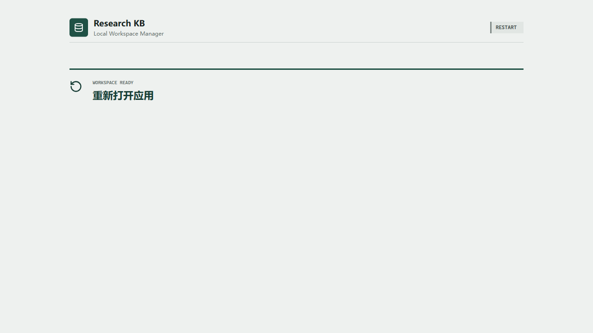
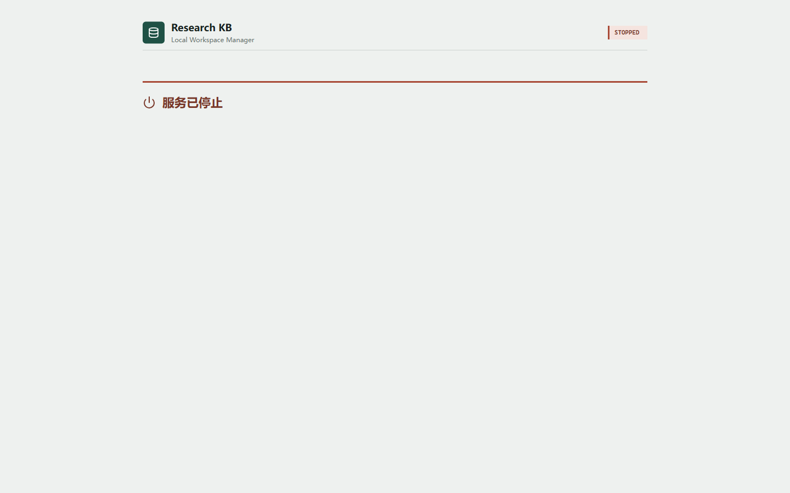
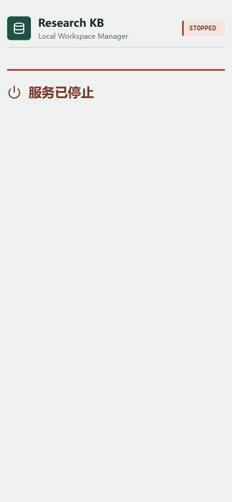

# Research KB App：本地科研知识工作区管理器

Research KB App 是 **Local Research Workspace Manager（本地科研知识工作区管理器）**
的 localhost Web App。它负责统一管理论文导入、解析、语义加工交接、阅读回源、
研究组织、Research Synthesis / 科研综合与启发、Obsidian 视图、知识库交换和运行维护。

项目采用以下分层：

```text
Research KB App
-> 本地浏览器界面、任务状态、预览审批、PDF 阅读与运维入口

research-kb-core
-> ID、schema、事务、provenance、确定性写入、Guardian 和可重建索引

Codex CLI / Claude Code CLI
-> Paper Card、Review Memory、问答、研究组织和 Research Synthesis / 科研综合与启发等语义任务
```

## 当前发布状态

- App `0.1.1b2` 是 **Windows-only 公开 beta**，已发布到
  [GitHub Releases](https://github.com/ZhangChengwei0722/research-kb-app/releases/tag/v0.1.1b2)
  和 [PyPI](https://pypi.org/project/research-kb-app/0.1.1b2/)。
- App `0.1.1b1` 已被 `0.1.1b2` 取代，不应继续安装。
- App 与 Core `0.1.1` 及 Application Service interface `1.23` 绑定验证；Core `0.1.1`
  已发布到 GitHub Releases 和 PyPI，App 会按固定版本自动解析该依赖。
- Windows beta 验证证据已齐备：干净安装、依赖一致性、生命周期回放、headless 与
  headed（有界面）Microsoft Edge GUI 验证均已记录；strict fresh Windows profile 证据
  通过 b1→b2 影响面重绑定继续有效（b1/b2 可执行载荷逐字节一致，仅版本与依赖元数据
  变化）。
- “公开 beta”表示可以下载、安装、运行和报告问题，不等于生产稳定版。发布卫生收口
  （用户文档同步与 `0.1.1b1` 下架）完成前，不把 beta 支持承诺扩大为生产承诺。

P0-P11 路线图和 R3 合成材料验收已关闭。物理 sleep/resume 不在当前 beta 支持承诺内。
现有 legacy CLI workspace 仍是正式 source of truth，本 beta 不执行 workspace migration
或 cutover。

- 许可证：[`Apache License 2.0`](LICENSE)
- 安装说明：[`docs/installation.md`](docs/installation.md)
- 安全报告：[`SECURITY.md`](SECURITY.md)，安全问题请私下报告，不要公开披露
- 支持矩阵：[`docs/support-matrix.md`](docs/support-matrix.md)
- 普通支持：[`SUPPORT.md`](SUPPORT.md)，仅按 synthetic reproduction 和脱敏边界处理
- 贡献流程：[`CONTRIBUTING.md`](CONTRIBUTING.md)，通过受保护 main 的 pull request 进行
- 发布记录：[`CHANGELOG.md`](CHANGELOG.md)
- 隐私与已知限制：[`docs/known-limitations-and-privacy.md`](docs/known-limitations-and-privacy.md)

## 安装与启动

要求 64 位 Windows 和 CPython 3.11 或 3.12。推荐在全新 virtualenv 中安装：

```powershell
python -m venv .venv-rkb
.\.venv-rkb\Scripts\Activate.ps1
python -m pip install --upgrade pip
pip install research-kb-app==0.1.1b2
pip check
research-kb-app --help
```

`research-kb-app --help` 应以退出码 0 结束。

偏好隔离式 CLI 工具的用户也可以使用 pipx：

```powershell
pipx install research-kb-app==0.1.1b2
pipx runpip research-kb-app check
research-kb-app --help
```

普通用户随后直接启动：

```powershell
research-kb-app
```

启动器会自动选择可用的 `127.0.0.1` 端口，输出 URL、一次性 startup token 和日志路径，
并在服务就绪后打开默认浏览器。第一次启动时，输入 token 后可通过图形界面新建工作区，
或采用一个现有且通过检查的 Shared Core workspace。文件夹选择只向浏览器返回临时 opaque
lease，不返回本地绝对路径、ACL 或 Core authority object。完成首次设置后按界面提示重新打开
App；后续启动会读取受管 profile。已安装版本不需要 Node.js、Vite development server、
手工指定端口或手写 workspace config。

完整安装、升级和故障排查步骤见 [`docs/installation.md`](docs/installation.md)；
配置字段和路径约束见 [`docs/configuration.md`](docs/configuration.md)；完整操作说明见
[`docs/r1-operator-guide.md`](docs/r1-operator-guide.md)。

## 界面预览

以下截图来自已安装 `0.1.1b2` 的 headed Microsoft Edge Playwright e2e 运行，全程使用
synthetic `p2-small` fixture，不包含真实论文或私有数据：







## 为什么需要这个软件

Research KB App 把“适合程序确定性完成的工作”和“需要 Agent 语义判断的工作”分开：

| 执行者 | 负责内容 |
|---|---|
| App + Core | 文件登记、指纹、解析、来源充分性、稳定 ID、schema 校验、事务、状态、索引、回源、审批写入、备份恢复和 Guardian |
| Codex / Claude Code | 论文理解、Paper Card、Review Memory、跨论文分析、问题回答、研究方向候选和 Research Synthesis / 科研综合与启发候选 |
| 用户 | 选择论文和任务、处理无法自动取得的 PDF、确认歧义、检查 Agent 结果并批准正式写入 |

App 不在内部启动 Agent，也不保存模型账号或 API key。它生成受 schema 和隐私策略约束的
任务提示词；用户可把任务交给 Codex CLI 或 Claude Code CLI，再把结构化结果导回 App 预览。

## 完整工作流

```text
启动本地 App 并选择 workspace
-> 上传 PDF 或从 watched inbox 选择文件
-> Registry + Parse + Source Adequacy
-> 原始研究 / 综述路线分流（混合型按综述处理）
-> App 生成外部 Agent handoff 和完整提示词
-> Codex 或 Claude Code 返回 schema-bound JSON
-> App 转义预览
-> 用户批准、要求修订或拒绝
-> Core 事务性提交并运行 Guardian
-> 阅读、Evidence 回源、研究组织、问答或 Research Synthesis / 科研综合与启发
```

来源充分性（Source Adequacy）按具体用途判断。一个解析结果可以足以制作基本 Paper Card，
但仍不足以支持图表、公式或补充材料 Evidence；只阻断消费相应能力的操作。

## 主要功能

| 模块 | 能力 |
|---|---|
| 总览 | 查看 workspace、Catalog、Pipeline Job、Agent Task 和健康状态 |
| 文献库 | 检索、筛选、分页浏览论文及其结构化产物 |
| 处理 | 上传 PDF、watched inbox 导入、路线选择、解析状态、Source Adequacy、恢复或取消任务 |
| Agent 交接 | 查看精确 payload、生成 Codex/Claude 提示词、导入候选 JSON、预览与审批 |
| 阅读 | 查看七段式 Primary Paper Card 或 background-only Review Memory |
| Evidence 回源 | 跳转 quote、PDF page 和 locator；可在 PDF.js 中查看，也可交给 UPDF/系统阅读器打开 |
| 问答 | 针对 1-4 篇论文执行单篇概述、方法分析、跨论文比较和找证据等 report-only 查询 |
| 发现 | 通过 Europe PMC 检索题目/摘要、保存 metadata candidate、解析 OA 路径并显式获取 PDF |
| 研究组织 | 维护 Direction、Field Map Entry、Question、Question Screening 和 Tag |
| Research Synthesis / 科研综合与启发 | 生成并审批 Synthesis、Review Angle、Insight 和 Cross-View 候选 |
| Obsidian | 将 Core 生成的 Markdown 单向同步到受管目录，不反向导入 canonical records |
| 知识库交换 | 按论文、问题、方向或 workspace 导出；安全预检并导入 immutable external records |
| 健康与维护 | Catalog 重建、stale maintenance、备份恢复和多 workspace 隔离检查 |

## 关键数据边界

- Primary Paper Card 的事实性单元必须闭合到 canonical Evidence。
- Review Memory 只提供明确标注的背景知识，不能进入 canonical Evidence。
- 普通知识问答是 `current_task_report`，不会自动改写 Paper Card、Evidence 或 Research Synthesis / 科研综合与启发。
- Agent 输出必须先经过 App 预览和用户批准，不能直接写 canonical records。
- SQLite/FTS 只是可删除、可重建的检索投影，不是知识事实来源。
- 浏览器只提交 workspace option ID 和 record ID，不接收服务器文件路径或 Core authority object。
- Exchange 导入记录默认是 immutable `external_unreviewed`，不会自动成为本地事实依据。
- PDF、parsed text、Agent output 和外部交换记录一律按不可信数据处理，不能扩大任务权限。

架构细节见 [docs/architecture.md](docs/architecture.md)，工作流细节见
[docs/workflow.md](docs/workflow.md)。

## Codex / Claude Code 交接

1. 在 App 中选择论文、任务类型和允许发送的内容范围。
2. 检查 Core 解析出的 payload 和 privacy scope。
3. 将 App 生成的完整 prompt manifest 交给 Codex CLI 或 Claude Code CLI。受限内容只有在
   Windows clipboard history 与 cloud sync 都明确关闭时才能使用一键复制；其他状态会
   fail closed，可改用 create-only 本地 task package。
4. 将 Agent 返回的单个 schema-bound JSON 导入 App。
5. 在 App 中检查候选内容并选择批准、修订或拒绝。

两种 Agent 使用同一 contract。切换 Agent 不会改变 canonical schema、ID、provenance
或审批规则；workspace 的 `agent_policy` 决定哪些内容可以进入任务 payload。

## 开发环境

额外要求：Node.js 24+。

初始化项目本地 Python 环境：

```powershell
powershell -ExecutionPolicy Bypass -File scripts/bootstrap.ps1 -CoreWheel <path-to-reviewed-wheel>
```

安装前端依赖并构建：

```powershell
npm ci
npm run build
```

使用本地配置启动：

```powershell
.\.venv\Scripts\research-kb-app.exe
# 或：.\.venv\Scripts\research-kb-app.exe --config <absolute-config-path>
```

## 验证

```powershell
.\.venv\Scripts\python.exe -m pytest -q
npm test
npm run typecheck
npm run lint
npm run build
npm run test:e2e
```

Integration/E2E 只使用 synthetic `p2-small` fixture，通过
`RKB_P2_SMALL_FIXTURE` 或同级 Core checkout 提供。测试从零生成 PDF，不应访问用户
workspace 或真实论文。

## 仓库结构

```text
src/research_kb_app/   FastAPI backend、launcher 和 HTTP adapters
web/                   React/TypeScript/Vite 前端源码
tests/                 Python、security、integration、frontend 和 E2E tests
scripts/               bootstrap、配置物化与验证工具
docs/                  架构、工作流、安装、支持矩阵、隐私与限制、操作指南
core-compatibility.json 受审查的 Core commit、wheel digest 和 interface pin
```

## 文档索引

- [当前架构](docs/architecture.md)
- [完整工作流](docs/workflow.md)
- [安装说明](docs/installation.md)
- [支持矩阵](docs/support-matrix.md)
- [配置说明](docs/configuration.md)
- [本地操作指南](docs/r1-operator-guide.md)
- [隐私与已知限制](docs/known-limitations-and-privacy.md)
- [安全政策](SECURITY.md)
- [支持说明](SUPPORT.md)
- [贡献指南](CONTRIBUTING.md)
- [变更记录](CHANGELOG.md)

P0-P11 历史计划、receipt 和 closure manifest 保留在私有审计仓库中，不进入脱敏
公共源码树；公共仓库只维护当前产品文档和可复现验证入口。

## 当前限制

- 仅运行在 localhost，尚未封装桌面安装程序。
- 仅正式支持 64 位 Windows 和 CPython 3.11/3.12。
- macOS 尚未完成与 Windows 同等级别的正式 App pilot 和验收。
- App 不直接启动 Codex 或 Claude Code，仅生成任务并接收结构化结果。
- Discovery 首版只接入 Europe PMC。
- Obsidian 仅支持受管目录的单向生成视图。
- Exchange 不执行 external record 到本地 canonical record 的语义合并。
- 物理 sleep/resume 不在当前 beta 支持承诺内，需在 beta 后另行验证。
- strict fresh Windows profile 证据通过 b1→b2 影响面重绑定继续有效，不因 b2 的元数据
  变更而重跑；headed Edge GUI 已逐 spec 记录。
- 尚未执行 legacy workspace migration、write freeze 或 cutover。

完整边界见 [`docs/known-limitations-and-privacy.md`](docs/known-limitations-and-privacy.md)。
